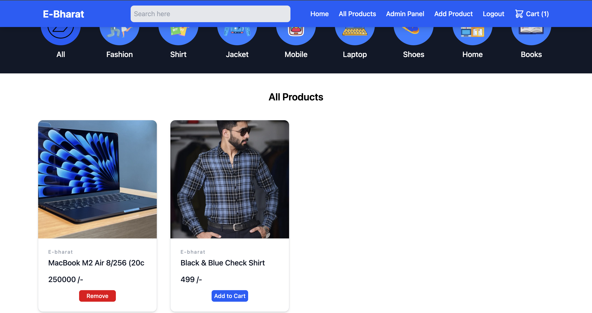
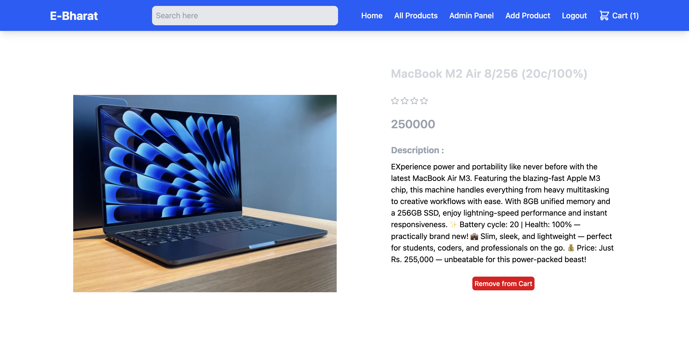
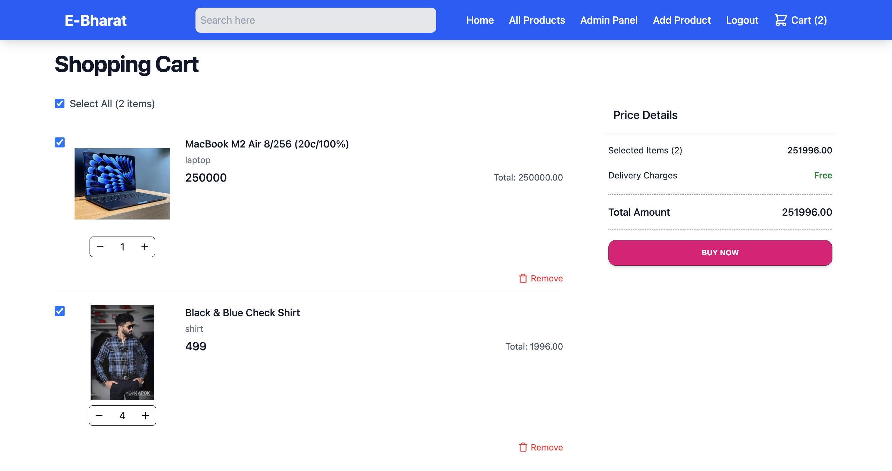
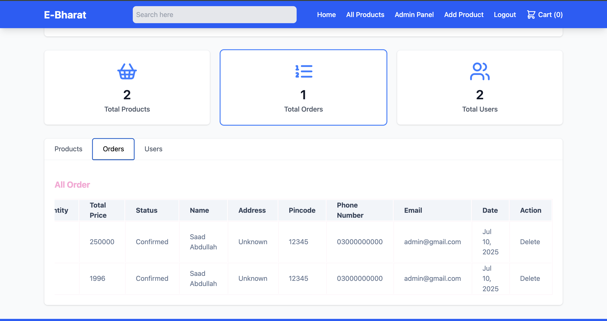
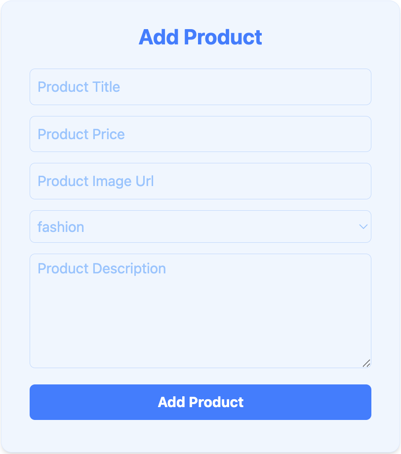
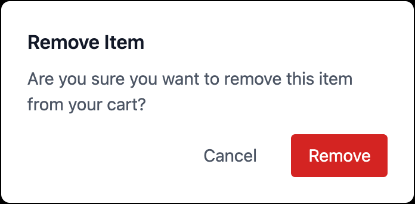

# Modern E-Commerce Platform

## Overview
A feature-rich e-commerce platform built with React and Firebase, offering a seamless shopping experience. The platform includes user and admin dashboards, product management, shopping cart functionality, and a modern UI powered by Material Tailwind and Redux.

## Screenshots

### Home Page


### Product Search


### Product Details


### Shopping Cart


### Admin Dashboard


### Product Management


### Delete Confirmation


## Key Features
- **User Authentication**: 
  - Separate user and admin access with protected routes
  - Secure login and signup functionality

- **Product Management**: 
  - Admin dashboard for product operations (Add/Update)
  - Product catalog with detailed product information
  - Shopping cart functionality
  - Real-time product search

- **User Features**:
  - User dashboard
  - Product browsing and search
  - Cart management
  - Order tracking

- **Modern UI/UX**: 
  - Responsive design with Material Tailwind
  - Toast notifications for user feedback
  - Smooth scrolling experience
  - Category-based filtering

## Technology Stack

### Frontend
- **React**: ^19.1.0 - Core frontend framework
- **Redux Toolkit**: ^2.8.2 - State management
- **React Router DOM**: ^7.6.3 - Navigation and routing
- **Material Tailwind**: ^2.1.10 - UI component library
- **Tailwind CSS**: ^4.1.11 - Utility-first CSS framework
- **Lucide React**: ^0.525.0 - Icon library
- **React Hot Toast**: ^2.5.2 - Toast notifications

### Backend & Services
- **Firebase**: ^11.10.0
  - Authentication
  - Firestore Database
  - Hosting

### Development Tools
- **Vite**: ^7.0.0 - Build tool and development server
- **ESLint**: ^9.29.0 - Code quality and consistency

## Project Structure
```
src/
├── components/     # Reusable UI components
├── pages/         # Main application pages
│   ├── home/
│   ├── admin-dashboard/
│   ├── user-dashboard/
│   ├── registration/
│   └── productInfo/
├── context/       # Application context
├── redux/         # State management
├── protectedRoute/# Route protection logic
├── firebase/      # Firebase configuration
└── assets/        # Static assets
```

## Security Features
- Protected routes for users and admins
- Firebase Authentication
- Secure data management

## License
No licence required Boss..!!
